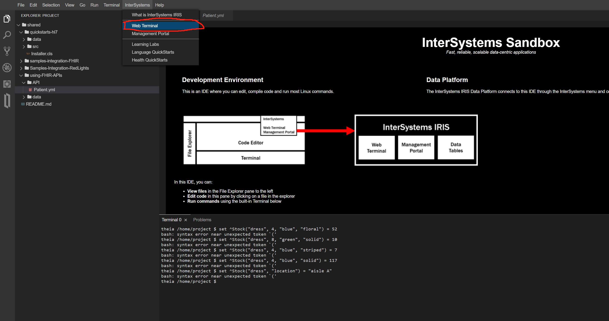

ifdef::env-github[]
:tip-caption: :bulb:
:note-caption: :information_source:
:important-caption: :heavy_exclamation_mark:
:caution-caption: :fire:
:warning-caption: :warning:
endif::[]
ifndef::imagesdir[:imagesdir: ../images]

= ObjectScript入门

注意点： +
1.1号教程中提到的"Managment Portal" / "Web Terminal" / "IDE/IDE Sandbox" 指的是完全不同的东西。虽然基本都是用IRIS特有的ObjectScript，但是语法有细微差别。 +
1号教程中的特指下图中的 "Web Terminal" +

=== 未完

== 官方资料 
1. https://gettingstarted.intersystems.com/language-quickstarts/objectscript-quickstart/[EN_ObjectScript入门教程_疑似有BUG_控制台中无write命令]

== 名词对照表
PlaceHolder : 暂时无中日版官方翻译 暂空
[options="header,footer" cols="s,s,s"]
|=======================
|中文|English|日本語

|=======================

    
